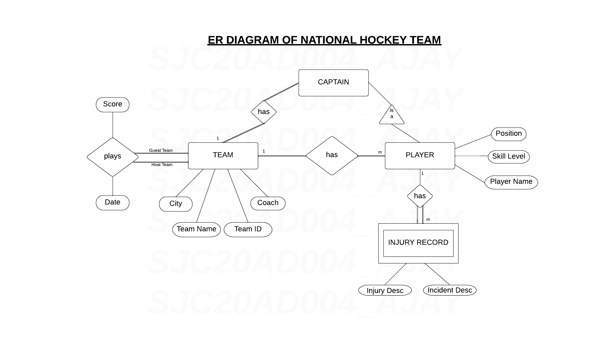

**AIM**

Design a database schema and ER Diagram for national hockey team

 

**REQUIREMENT**

The NHL has many teams, each team has a name, a city, a coach, a captain and a set of players. Each player belongs to only one team. Each player has a name, position, skill level, and a set of injury records. Team captain is also a player. A game is played between two teams, and the game has a date and scores 

 

**SAMPLE DATABASE DESIGN**

* Team(team_id, team_name, captain, city, coach)
    * team_id is primary key

* Player(player_id, team_id, player_name, position, skill_level) 
    * team_id is a foreign key that references Team table

* Injury_Record(player_id, incident_desc, injury_desc)
    * player_id is a foreign key that references player table.

* Game(game_id, host_team, guest_team, host_team_score, guest_team_score, game_date)

 

**ER DIAGRAM**

