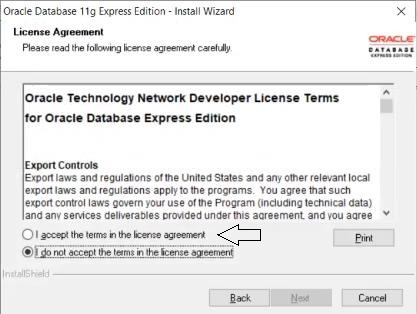

### Quick Navigation

* Click the link to go to specific heading

  * [Downloading Zip File](#Download-and-start-installation)

  * [Installation](#Run-setup-file)

  * [User creation](#User-creation)

  * [Demo Queries](#Demo-Queries)

  * [Testing](#Testing)

  * [Troubleshooting](#Troubleshooting)

  * [Dropping user](#Dropping-user)

 

<!-- ------------------------------------------- -->

---

## _put your mouse cursor on images to see instructions_

 

### Download and start installation

* Go to [this link](https://www.filehorse.com/download-oracle-database-express/screenshots/)

* Click `Free Download` then click `Start Download`

* Go to the downloaded file folder and open the zip file

* No need to extract the zip, just open it, and double-click the `setup.exe`

 

<!-- ------------------------------------------- -->
---

### Installation

* Run `setup.exe`

* Extracting... wait

* Accept the agreements

* Remember the password

* Click `Install`

* Loading...Finished

 

<!-- ------------------------------------------- -->

---

### User creation

* Go to `START` and type `sql plus`

* open the `sql plus` application & you will see:

* Type near `Enter user-name:`

        / as sysdba

* For changing the settings to accept any type of username

        alter session set "_ORACLE_SCRIPT"=true;

* Change `<username>` to your username
* And `<password>` to your password, set a good password like `1234` :relieved: 

        create user <username> identified by <password>;

* Change `<username>` to your username

        grant unlimited tablespace to <username>;

* Change `<username>` to your username

        grant resource, connect, dba to <username>;

* Sample Screenshot:

 

### **_Now close the `SQL Plus` app & open it again & `login` with your new `username` & `password`_.**

 

<!-- ------------------------------------------- -->

---

### Testing

* For login, type your `username` & `password`
  * **password won't be displayed there, but type your full password correctly and hit enter.**

* And, try creating some demo tables & inserting values in it

* Need some real queries:?, Go with [basic SQL programs](https://github.com/004Ajay/SQL#programs)

 

<!-- ------------------------------------------- -->

---

### Troubleshooting

* Big table's display not correct?, Try [display correction codes](https://github.com/004Ajay/SQL/blob/main/SqlPlusCorrectionCodes.sql)

* While working with PL/SQL codes, don't forget to put ↓ at first
                        
        set serveroutput on;

 

<!-- ------------------------------------------- -->

---

### Dropping user

* Use this when you need to drop a user, `this is not a part of installation`

* Drop unwanted users
  * `use this carefully`, it will `delete all tables and related things to the user` you are dropping

        drop user <username>

 